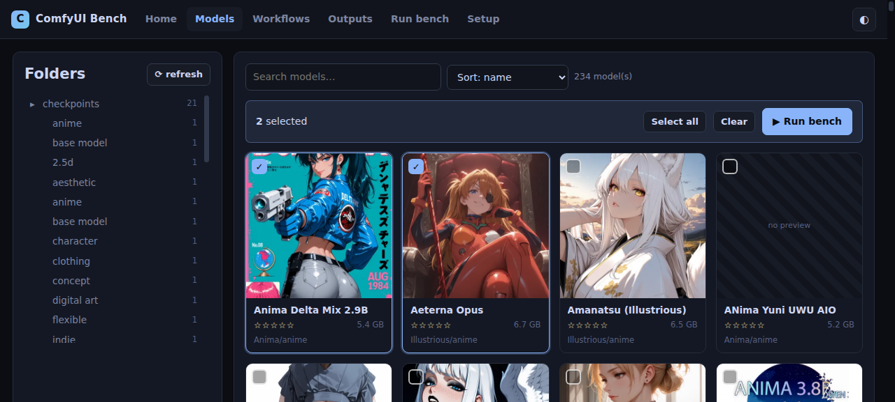

# ComfyUI Bench

A small, self-hosted web app for **benchmarking ComfyUI models over a local
network**. Point it at a running ComfyUI instance, pick which models to test,
run a fixed-seed test workflow in the background, watch live progress, and
compare the resulting images side-by-side (or with a drag slider).

Everything runs from one machine; the UI is reachable from any device on your
LAN. No build step — it's a FastAPI backend + a dependency-free HTML/CSS/JS
frontend.

> ## ⚠️ Disclaimer — this was written entirely with AI
> The **entire codebase** in this repository was generated by AI (LLM-assisted
> coding); there was no hand-written source. It is provided **as-is**, with no
> warranty of correctness, security, or fitness for any purpose. It has not been
> professionally audited. **Review the code before running it**, especially
> anything that touches your disk, your ComfyUI instance, or your network. Use
> at your own risk.



## Features

- **Model browser** — folder tree of every model under your configured roots,
  each shown with the preview that ships in its folder (an image, or a short
  **video** like an `.mp4` sample when there's no image), its name, size,
  Civitai metadata (author / likes / downloads), and your own **star rating +
  notes**. Search, sort, and a **⟳ refresh** button to re-scan.
- **Run bench** — pick a workflow + any set of models + an optional prompt and
  a **fixed seed** (for fair comparisons). The bench runs **in the background**;
  a live `xx/yy` counter shows how many are done.
- **Run queue** — benches are **serialized**: only one runs at a time. Start
  another bench while one is in flight and it simply **lines up** (shown as
  `queued · #n`) and starts automatically in order when the current one
  finishes. You can also **■ stop** a running bench (this **hard-stops** it:
  it interrupts the current prompt *and* clears ComfyUI's pending queue, so the
  GPU is actually freed) or **drop** a queued one.
- **Robust execution** — a single model failing or hanging **never crashes
  the whole bench**: it's marked `error`/`timeout` and the run moves on to the
  next model. A **stall guard** detects a prompt stuck in ComfyUI's queue and
  fails that model early instead of waiting out the full per-model timeout.
- **Outputs** — browse generated images by bench, **Select all** (visible even
  with nothing selected; selects the currently-filtered results), then
  **compare**: exactly 2 → a drag **slider**, 3+ → a responsive **grid** —
  both open in a **full-window** view for close inspection. Every thumbnail has
  a translucent **👁 eye** button to open that single image full-size.
- **Workflows** — store, rename, and delete multiple test workflows (ComfyUI
  API-format JSON prompts). Add your own at any time.
- **Home / history** — every bench you've run, with status and quick links to
  its outputs.
- **Setup page** — ComfyUI URL, model roots, output root, default seed,
  dark/light theme, and the access token (copy / regenerate).
- **Dark mode** — on by default, toggleable, remembered per browser.
- **Token auth** — a single access token gates the UI so it's safe to expose on
  a trusted LAN.

## Requirements

- Python **3.10+** (3.12 tested)
- A **running** ComfyUI server (the app talks to its HTTP + WebSocket API; it
  does not host ComfyUI itself)
- Models with a preview next to the weight file (the app auto-discovers the
  preview that lives in the same folder as the `.safetensors` / `.ckpt`: an
  image such as `.png`/`.jpg`/`.webp`, or — if there's no image — a short
  video such as `.mp4`/`.webm`/`.mov`)

## Installation

```bash
# 1. Clone
git clone git@github.com:thomasbidou/comfyui_bench.git
cd comfyui_bench

# 2. Create a virtualenv and install dependencies
python3 -m venv .venv
source .venv/bin/activate
pip install -r requirements.txt

# 3. Make sure ComfyUI is running (default http://127.0.0.1:8188)
#    e.g.:  python main.py --port 8188   (in your ComfyUI checkout)

# 4. Start the app
python server.py
```

The app listens on `0.0.0.0:7860` by default. Open it in a browser:

- Local:        `http://127.0.0.1:7860`
- From your LAN: `http://<this-machine-ip>:7860`

You'll be asked for the **access token**. On first run one is generated for you
and shown on the **Setup** page (or in `state/config.json`). Save it — you'll
need it to unlock the UI from other devices.

> **First-run configuration** is stored under `state/` (created automatically):
> `config.json` (connection + token), `workflows.json`, `benches.json`,
> `outputs.json`, `user_meta.json` (stars/notes). Delete `state/` to reset.

### Configuring model roots & ComfyUI URL

The defaults assume ComfyUI at `http://127.0.0.1:8188` and model roots:

```
~/ComfyUI2/models/checkpoints
~/ComfyUI2/models/diffusion_models
```

Change these on the **Setup** page (or edit `state/config.json`), then click
**⟳ refresh** on the Models page. The **Test connection** button confirms the
ComfyUI link and reports the GPU it sees.

### Running as a service (recommended)

The app is meant to be **always on**. On this box it runs as a **systemd user
service** (`comfyui-bench`), so it starts at boot (login not required —
`loginctl enable-linger` is on) and auto-restarts if it crashes.

```bash
# one-time install (unit lives in ~/.config/systemd/user/comfyui-bench.service)
systemctl --user daemon-reload
systemctl --user enable --now comfyui-bench

# day-to-day
systemctl --user status  comfyui-bench   # state + recent log
systemctl --user start|stop|restart comfyui-bench
journalctl --user -u comfyui-bench -f     # follow the log
```

> ⚠️ Do **not** also run `uvicorn` by hand — it would fight the service for
> port `7860`. Manage it via `systemctl --user` instead.

If you just want a quick manual run (e.g. for testing):

```bash
# from the repo directory
uvicorn server:app --host 0.0.0.0 --port 7860
```

## How a bench works

1. You pick a **workflow** (an API-format prompt containing a
   `CheckpointLoaderSimple` or `UNETLoaderWithName` node) and one or more
   models.
2. For each model the app swaps the model reference into the workflow's loader
   node, applies the **fixed seed** to every seed node, and (optionally) your
   prompt override, then queues it on ComfyUI.
3. Progress is streamed from ComfyUI's WebSocket to the UI, so you see the
   `xx/yy` counter and per-model status update live.
4. When ComfyUI reports `execution_success`, the produced image is captured
   from `/history` and stored under the bench in `outputs.json`.

Because the seed is fixed and the workflow is identical across models, the only
variable is the model — which is exactly what you want when comparing them.

## Security notes

- The UI is gated by a **single token** (cookie `cb_token`, also accepted as a
  `?token=` query param or `Authorization: Bearer`). Generate a strong one on
  the Setup page.
- This is designed for a **trusted LAN**. It is *not* hardened for the open
  internet: don't expose port `7860` publicly without putting a reverse proxy
  + TLS in front.
- File serving is restricted to the configured output root and model roots —
  the server rejects path traversal outside those directories.

## Project layout

```
config.py      state / config management, path allowlists, token auth
comfy.py       ComfyUI HTTP client + live WebSocket event bridge
models.py      model scanner (roots, image/video previews, Civitai metadata, stars/notes)
workflows.py   workflow analysis (loader/seed/prompt node detection, overrides)
bench.py       background bench runner + live progress hub
server.py      FastAPI app, REST routes, WebSocket, static serving
static/        index.html, style.css, app.js  (the SPA — no build step)
state/         runtime state (gitignored): config, workflows, benches, outputs
```

## License

MIT — see the code. Use it to benchmark your own models.
